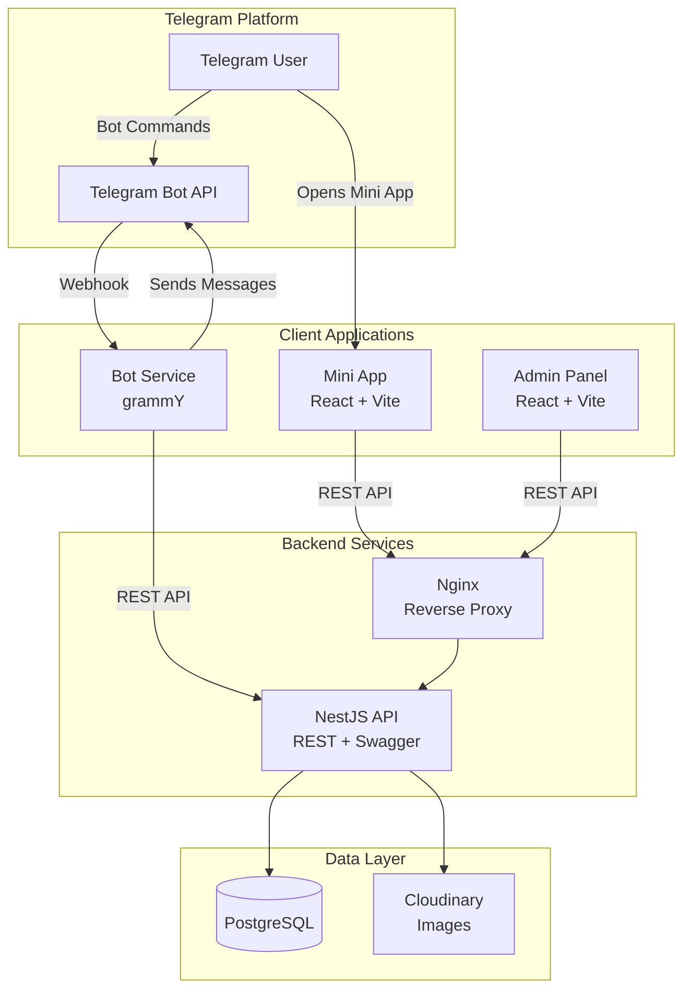

# 2. High-Level Architecture

## 2.1 Technical Summary

FitCalendar is a hybrid Telegram application combining a Bot for quick interactions, a Mini App for rich schedule browsing, and an Admin Panel for club management. The architecture follows a monolithic API pattern with multiple client applications, deployed as containerized services.

The system uses NestJS as a unified backend serving REST APIs to all clients, with TypeORM managing PostgreSQL data. Two React + Vite frontends (Mini App and Admin) share a common UI component library. The grammY bot framework handles Telegram interactions via webhooks. Cloudinary provides image optimization for coach photos.

## 2.2 Platform and Infrastructure

**Platform:** VPS (DigitalOcean/Hetzner) with Docker Compose
**Key Services:** PostgreSQL, Nginx (reverse proxy), Cloudinary (images)
**Regions:** Single region (Europe - targeting Russian market)

**Rationale:** PRD targets 500 concurrent users — VPS handles this with predictable cost (~$20-40/month). Docker already configured in starter. Can migrate to managed platforms later if needed.

## 2.3 Repository Structure

**Structure:** Monorepo (existing Nx workspace)
**Monorepo Tool:** Nx 21 with pnpm workspaces

```
fitcalendar/
├── apps/           # Deployable applications
│   ├── api/        # NestJS backend
│   ├── bot/        # Telegram bot (grammY)
│   ├── mini-app/   # Telegram Mini App (React + Vite)
│   └── admin/      # Admin Panel (React + Vite)
├── libs/           # Shared libraries
│   ├── shared/     # Types, constants, utilities
│   ├── ui/         # Shared React components
│   └── db/         # TypeORM entities & migrations
└── docker/         # Docker configurations
```

## 2.4 Architecture Diagram



## 2.5 Architectural Patterns

-   **Monolithic API:** Single NestJS service handles all business logic — appropriate for MVP scale
-   **Module-Based Backend:** NestJS modules for domain separation (schedule, coaches, users, reminders)
-   **Shared Component Library:** Common UI components in `libs/ui` for consistent design
-   **Repository Pattern:** TypeORM repositories abstract data access
-   **Webhook-Based Bot:** grammY with webhook mode for production efficiency
-   **API-First Design:** OpenAPI/Swagger documentation generated from decorators

---
