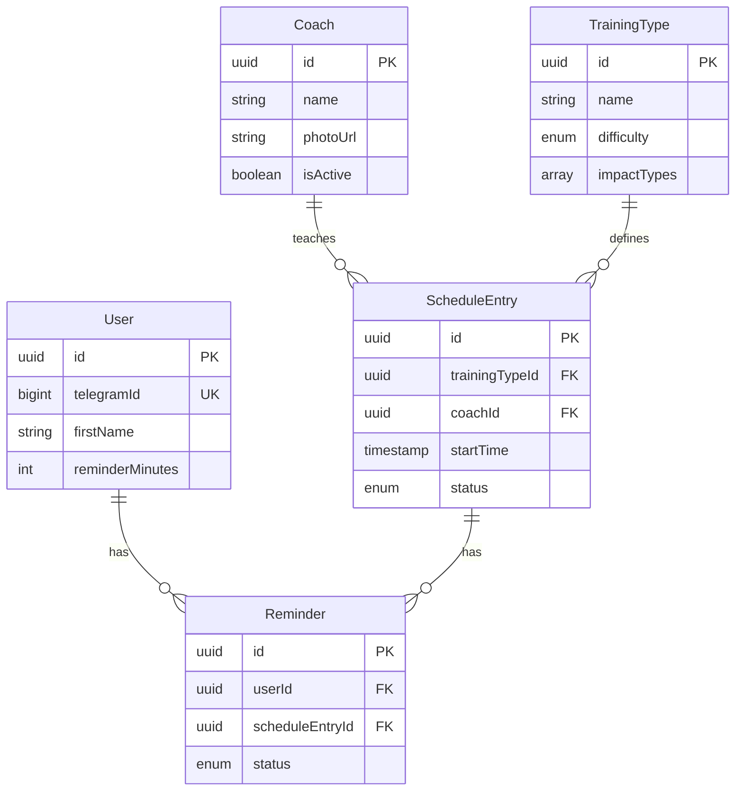

# 4. Data Models

## 4.1 Entity Overview

| Entity            | Purpose                                           |
| ----------------- | ------------------------------------------------- |
| **User**          | Telegram user interacting with Mini App/Bot       |
| **Coach**         | Fitness instructor who teaches classes            |
| **TrainingType**  | Definition of a class type with difficulty/impact |
| **ScheduleEntry** | Specific class instance on the schedule           |
| **Reminder**      | User subscription for class notification          |
| **ClubInfo**      | Singleton with club contact information           |
| **AdminUser**     | Staff member with admin panel access              |

## 4.2 TypeScript Interfaces

```typescript
// User - Telegram user
interface User {
    id: string;
    telegramId: number;
    firstName: string;
    lastName: string | null;
    username: string | null;
    reminderMinutes: number; // default: 30
    createdAt: Date;
    updatedAt: Date;
}

// Coach - Fitness instructor
interface Coach {
    id: string;
    name: string;
    bio: string | null;
    photoUrl: string | null;
    specializations: string[];
    certifications: string[];
    isActive: boolean;
    createdAt: Date;
    updatedAt: Date;
}

// TrainingType - Class definition
interface TrainingType {
    id: string;
    name: string;
    description: string | null;
    difficulty: 'beginner' | 'intermediate' | 'advanced';
    impactTypes: ('cardio' | 'strength' | 'flexibility' | 'balance')[];
    equipment: string[];
    isActive: boolean;
    createdAt: Date;
    updatedAt: Date;
}

// ScheduleEntry - Specific class instance
interface ScheduleEntry {
    id: string;
    trainingTypeId: string;
    coachId: string;
    startTime: Date;
    durationMinutes: number;
    status: 'scheduled' | 'cancelled';
    cancellationReason: string | null;
    createdAt: Date;
    updatedAt: Date;
}

// Reminder - Notification subscription
interface Reminder {
    id: string;
    userId: string;
    scheduleEntryId: string;
    notifyAt: Date;
    status: 'pending' | 'sent' | 'failed';
    sentAt: Date | null;
    createdAt: Date;
}

// ClubInfo - Singleton
interface ClubInfo {
    id: string;
    name: string;
    address: string;
    phone: string;
    workingHours: Record<string, { open: string; close: string } | null>;
    latitude: number | null;
    longitude: number | null;
    logoUrl: string | null;
    updatedAt: Date;
}

// AdminUser - Staff member
interface AdminUser {
    id: string;
    email: string;
    passwordHash: string;
    name: string;
    isActive: boolean;
    lastLoginAt: Date | null;
    createdAt: Date;
    updatedAt: Date;
}
```

## 4.3 Entity Relationship Diagram



---
