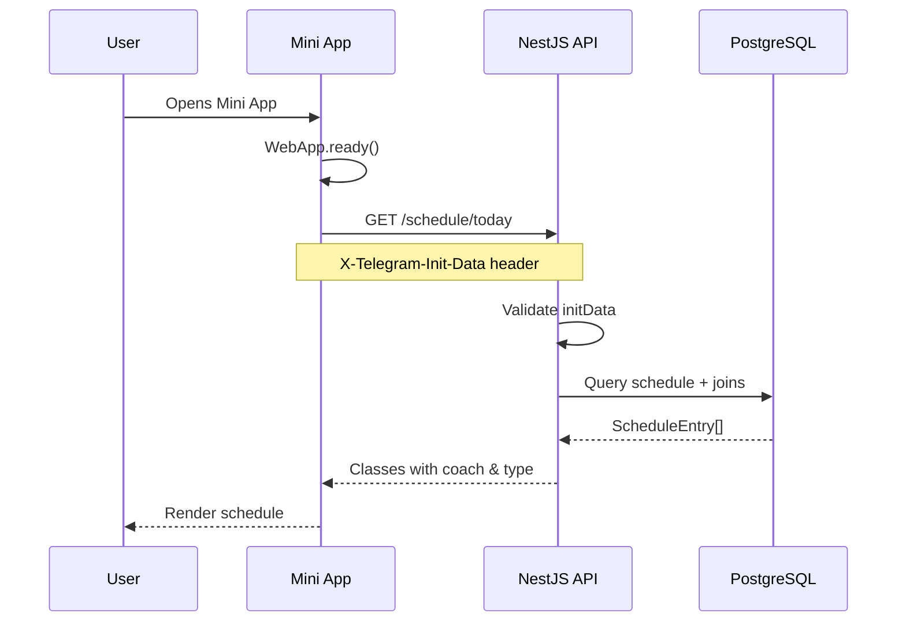
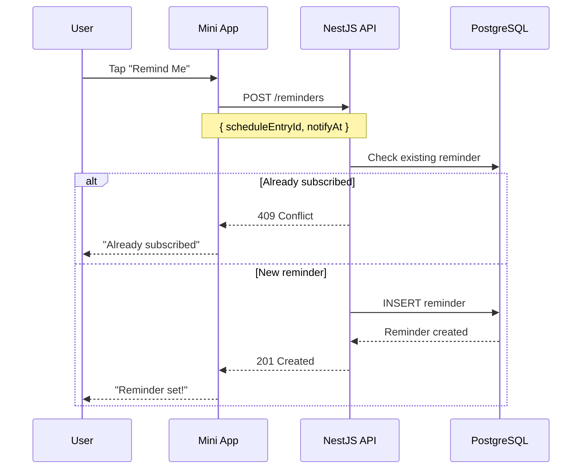
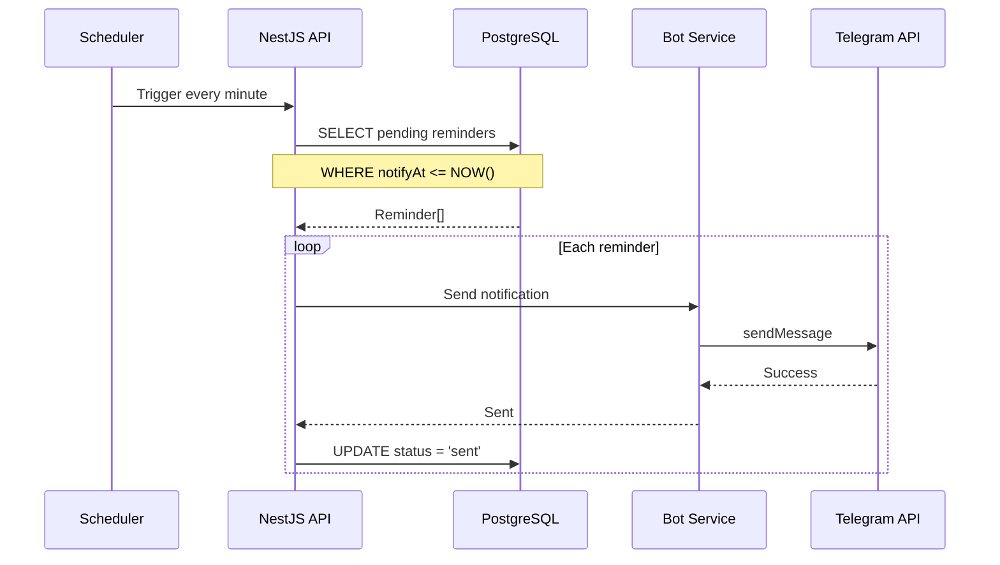
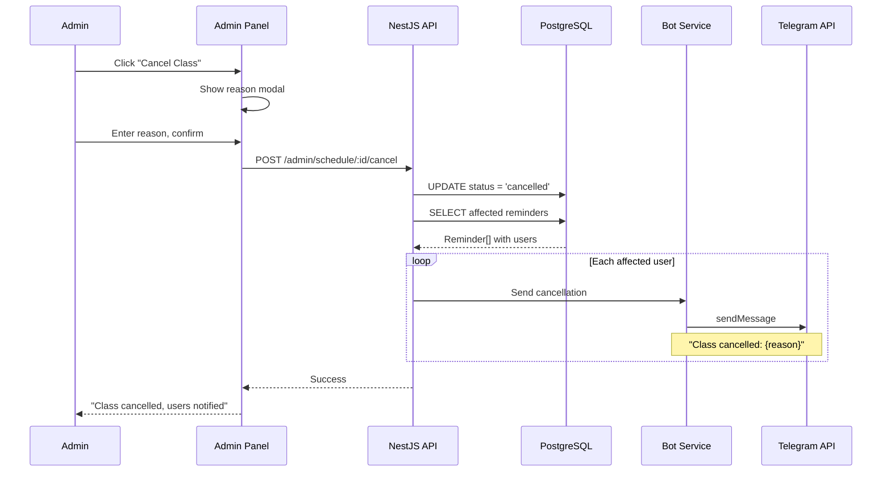

# 8. Core Workflows

## 8.1 User Views Schedule

```mermaid
sequenceDiagram
    participant U as User
    participant MA as Mini App
    participant API as NestJS API
    participant DB as PostgreSQL

    U->>MA: Opens Mini App
    MA->>MA: WebApp.ready()
    MA->>API: GET /schedule/today
    Note over MA,API: X-Telegram-Init-Data header
    API->>API: Validate initData
    API->>DB: Query schedule + joins
    DB-->>API: ScheduleEntry[]
    API-->>MA: Classes with coach & type
    MA-->>U: Render schedule
```

## 8.2 User Sets Reminder

```mermaid
sequenceDiagram
    participant U as User
    participant MA as Mini App
    participant API as NestJS API
    participant DB as PostgreSQL

    U->>MA: Tap "Remind Me"
    MA->>API: POST /reminders
    Note over MA,API: { scheduleEntryId, notifyAt }
    API->>DB: Check existing reminder
    alt Already subscribed
        API-->>MA: 409 Conflict
        MA-->>U: "Already subscribed"
    else New reminder
        API->>DB: INSERT reminder
        DB-->>API: Reminder created
        API-->>MA: 201 Created
        MA-->>U: "Reminder set!"
    end
```

## 8.3 Reminder Notification Sent

```mermaid
sequenceDiagram
    participant CRON as Scheduler
    participant API as NestJS API
    participant DB as PostgreSQL
    participant BOT as Bot Service
    participant TG as Telegram API

    CRON->>API: Trigger every minute
    API->>DB: SELECT pending reminders
    Note over API,DB: WHERE notifyAt <= NOW()
    DB-->>API: Reminder[]
    loop Each reminder
        API->>BOT: Send notification
        BOT->>TG: sendMessage
        TG-->>BOT: Success
        BOT-->>API: Sent
        API->>DB: UPDATE status = 'sent'
    end
```

## 8.4 Admin Cancels Class

```mermaid
sequenceDiagram
    participant A as Admin
    participant AP as Admin Panel
    participant API as NestJS API
    participant DB as PostgreSQL
    participant BOT as Bot Service
    participant TG as Telegram API

    A->>AP: Click "Cancel Class"
    AP->>AP: Show reason modal
    A->>AP: Enter reason, confirm
    AP->>API: POST /admin/schedule/:id/cancel
    API->>DB: UPDATE status = 'cancelled'
    API->>DB: SELECT affected reminders
    DB-->>API: Reminder[] with users
    loop Each affected user
        API->>BOT: Send cancellation
        BOT->>TG: sendMessage
        Note over BOT,TG: "Class cancelled: {reason}"
    end
    API-->>AP: Success
    AP-->>A: "Class cancelled, users notified"
```

---
