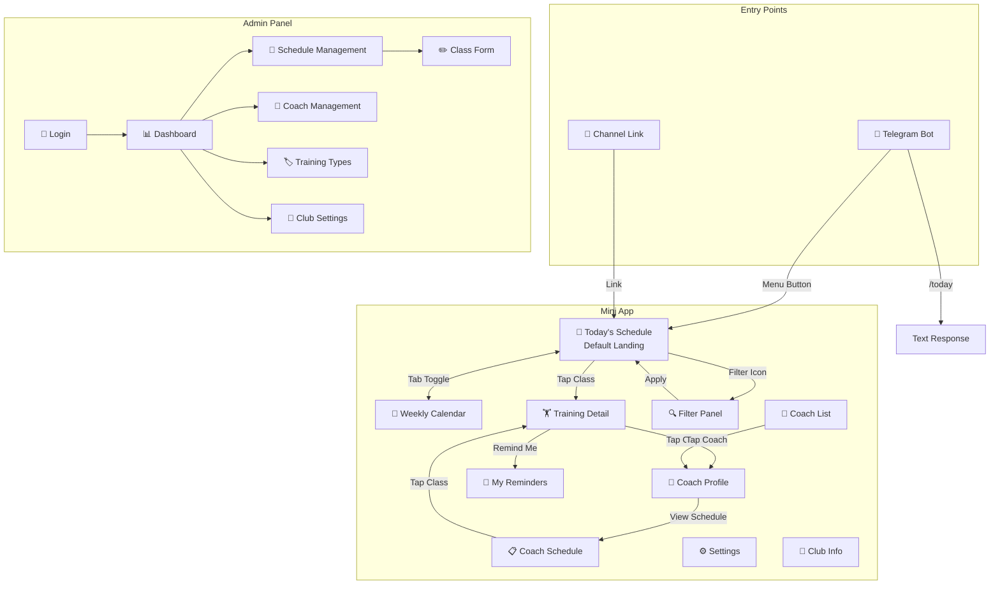
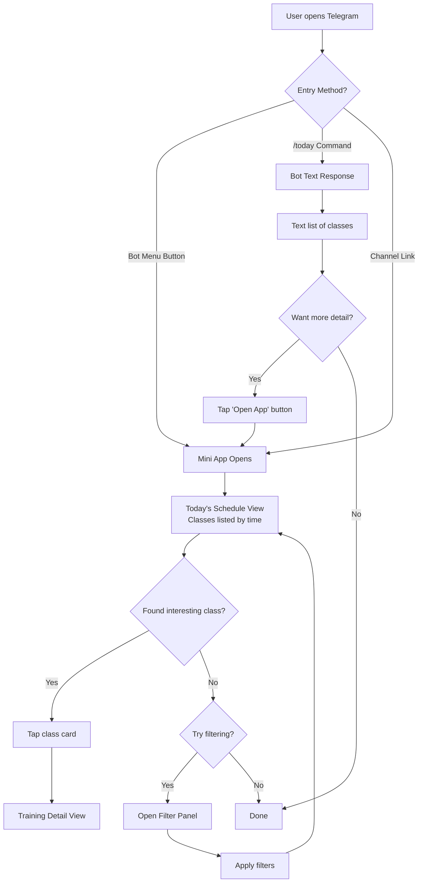
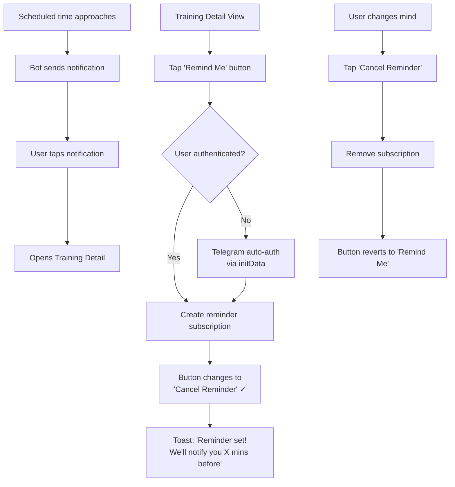
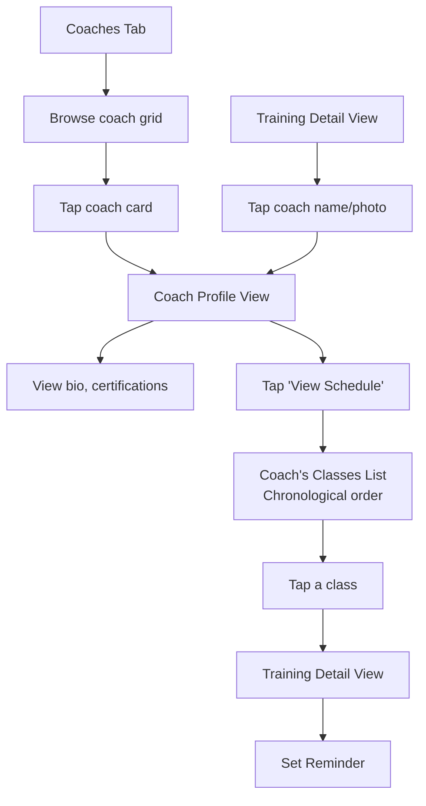
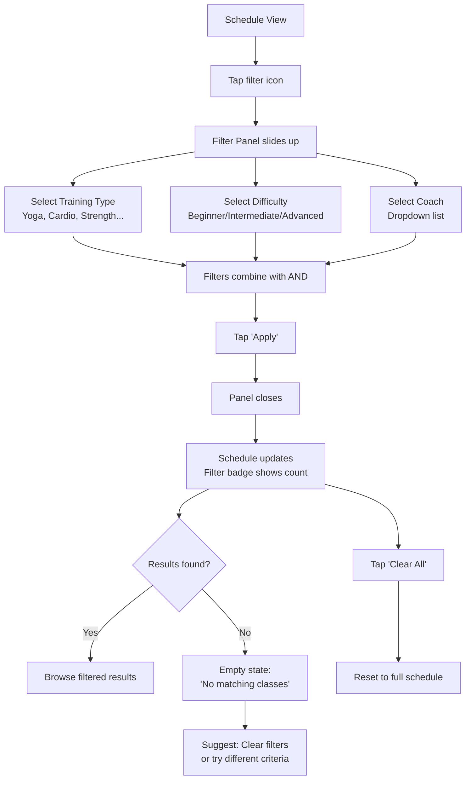
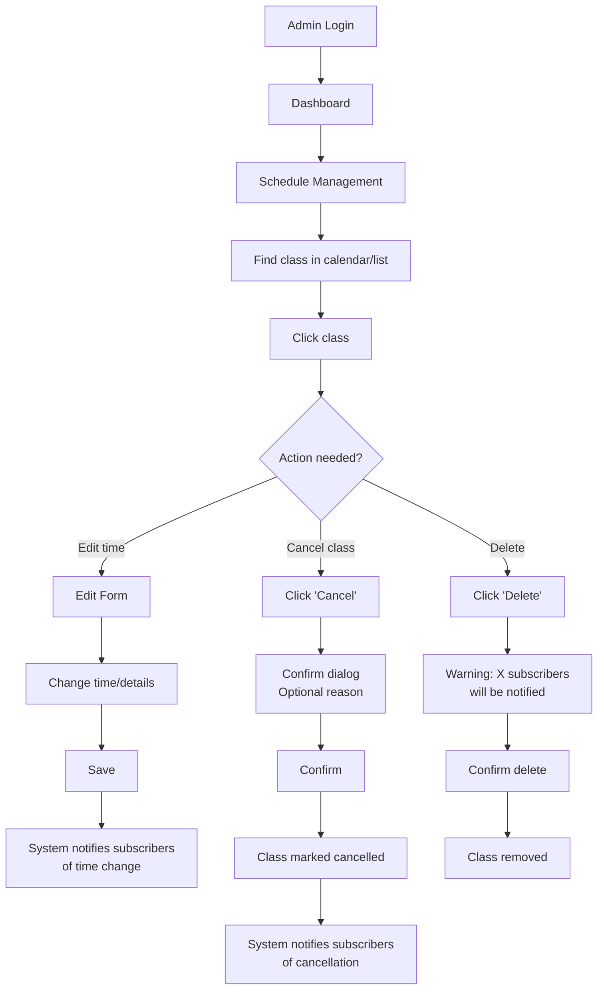

# FitSchedule Telegram UI/UX Specification

## 1. Introduction

This document defines the user experience goals, information architecture, user flows, and visual design specifications for **FitSchedule Telegram's** user interface. It serves as the foundation for visual design and frontend development, ensuring a cohesive and user-centered experience.

### 1.1 Overall UX Goals & Principles

#### Target User Personas

| Persona                      | Description                                                                                                                                               |
| ---------------------------- | --------------------------------------------------------------------------------------------------------------------------------------------------------- |
| **Busy Professional (Anna)** | Adults 25-45, health-conscious, daily Telegram users who value speed and convenience. Need to check schedule in under 2 seconds. Attend 2-4 classes/week. |
| **Coach-Follower**           | Members who prefer specific trainers and want to easily find and follow their favorite coach's schedule. Value building relationships with instructors.   |
| **Fitness Beginner**         | New or returning gym members who need clear difficulty indicators and equipment information to find classes appropriate for their level.                  |

#### Usability Goals

| Goal                     | Target                                                                                          |
| ------------------------ | ----------------------------------------------------------------------------------------------- |
| **Speed to information** | Today's schedule visible in <2 seconds from opening                                             |
| **Decision confidence**  | Users can determine if a class suits them in <5 seconds (difficulty, impact, equipment visible) |
| **Zero learning curve**  | First-time users complete core tasks without guidance                                           |
| **Proactive awareness**  | Users never miss a cancellation or time change                                                  |

#### Design Principles

1. **Telegram-Native** — Feel like a natural extension of Telegram, not a foreign web app
2. **Information-First** — Show the schedule immediately; decoration comes second
3. **Scannable Hierarchy** — Visual badges and color coding enable quick pattern recognition
4. **Minimal Taps** — Core flows (today's schedule, set reminder) in 1-2 taps
5. **Proactive Not Reactive** — Push notifications keep users informed without requiring them to check

### 1.2 Change Log

| Date       | Version | Description                 | Author            |
| ---------- | ------- | --------------------------- | ----------------- |
| 2026-01-09 | 1.0     | Initial UI/UX Specification | Sally (UX Expert) |

---

## 2. Information Architecture (IA)

### 2.1 Site Map / Screen Inventory



### 2.2 Navigation Structure

**Primary Navigation (Mini App Bottom Tabs):**

| Tab       | Icon | Screen            | Purpose                |
| --------- | ---- | ----------------- | ---------------------- |
| Schedule  | 📅   | Today/Week toggle | Core schedule browsing |
| Coaches   | 👥   | Coach List        | Discover trainers      |
| Reminders | 🔔   | My Reminders      | Manage subscriptions   |
| Club      | 🏢   | Club Info         | Contact & location     |

**Secondary Navigation:**

-   **Filter Panel**: Slide-up sheet from schedule views (not a separate tab)
-   **Settings**: Accessible from hamburger menu or profile icon
-   **Training Detail**: Push navigation from schedule cards

**Breadcrumb Strategy:**

-   No traditional breadcrumbs (space-constrained Mini App)
-   Back arrow navigation with contextual titles
-   Telegram's native back gesture supported

---

## 3. User Flows

### 3.1 Check Today's Schedule (Primary Flow)

**User Goal:** Find out what classes are available today
**Entry Points:** Bot menu button, /today command, Channel link
**Success Criteria:** User sees today's classes within 2 seconds



**Edge Cases & Error Handling:**

-   Empty schedule: Show friendly "No classes today" with link to weekly view
-   Loading failure: Show retry button with cached data if available
-   Slow connection: Skeleton loading states for cards

---

### 3.2 Set a Class Reminder

**User Goal:** Get notified before a class they want to attend
**Entry Points:** Training Detail View
**Success Criteria:** Confirmation shown, reminder received at preferred time



**Edge Cases & Error Handling:**

-   Class already started: Hide "Remind Me" button
-   Class cancelled after reminder set: Auto-remove reminder, send cancellation notice
-   Duplicate tap: Idempotent — show existing reminder state

---

### 3.3 Find a Coach's Schedule

**User Goal:** See all upcoming classes taught by a favorite coach
**Entry Points:** Coach List, Training Detail (coach name tap)
**Success Criteria:** Filtered view showing only that coach's classes



**Edge Cases & Error Handling:**

-   Coach has no upcoming classes: Show "No upcoming classes" with last taught date
-   Coach deactivated: Hide from list, show "Coach unavailable" if deep-linked

---

### 3.4 Filter Schedule by Preferences

**User Goal:** Find classes matching specific criteria (difficulty, type, coach)
**Entry Points:** Filter icon on schedule views
**Success Criteria:** Schedule updates to show only matching classes



**Edge Cases & Error Handling:**

-   No results: Suggest clearing filters, show alternative options
-   Filter persists across sessions (within reason — clear on new day)

---

### 3.5 Admin — Update Schedule (Quick Edit)

**User Goal:** Quickly update or cancel a class
**Entry Points:** Admin Dashboard, Schedule Management
**Success Criteria:** Change saved, subscribers notified automatically



**Edge Cases & Error Handling:**

-   Edit class with active reminders: Warn admin, proceed with notifications
-   Cancel near start time: Priority notification with apology message
-   Concurrent edit: Optimistic locking, show conflict resolution

---

## 4. Wireframes & Mockups

### 4.1 Design Files

**Recommended Design Tool:** Figma

**Design File Structure:**

```
FitSchedule Telegram/
├── 🎨 Mini App/
│   ├── Schedule Views
│   ├── Training Detail
│   ├── Coach Screens
│   ├── Reminders & Settings
│   └── Components
├── 🖥️ Admin Panel/
│   ├── Dashboard
│   ├── Schedule Management
│   ├── Forms
│   └── Components
└── 📐 Design System/
    ├── Colors & Typography
    ├── Icons & Assets
    └── Component Library
```

### 4.2 Key Screen Layouts

#### Today's Schedule (Default Landing)

**Purpose:** Show today's classes immediately upon app open

**Key Elements:**

-   Header with date and filter icon
-   Segmented control: Today / Week toggle
-   Scrollable list of class cards
-   Bottom navigation tabs

**Interaction Notes:**

-   Tap card → Training Detail
-   Tap filter icon → Filter panel slides up
-   Pull down → Refresh

---

#### Training Detail View

**Purpose:** Full information for informed decision + reminder action

**Key Elements:**

-   Back navigation
-   Class header with time/duration
-   Coach section (tappable to profile)
-   Difficulty & impact badges
-   Equipment list
-   Primary CTA: Remind Me button

**Interaction Notes:**

-   Tap coach row → Coach Profile
-   Tap "Remind Me" → Toggle to "Cancel Reminder ✓"
-   Button disabled if class started/passed

---

#### Filter Panel (Bottom Sheet)

**Purpose:** Refine schedule to user preferences

**Key Elements:**

-   Drag handle for dismissal
-   Training Type chips (multi-select)
-   Difficulty radio buttons (single-select)
-   Coach dropdown
-   Clear All + Apply buttons

**Interaction Notes:**

-   Apply closes panel and updates schedule
-   Active filters shown as badge on filter icon

---

#### Coach Profile

**Purpose:** Build trust, show expertise, access coach's schedule

**Key Elements:**

-   Large photo header
-   Name and title
-   Specialization tags
-   Certifications list
-   Bio text
-   CTA: View Schedule button

---

#### Admin — Schedule Management (Desktop)

**Purpose:** Overview and quick management of weekly schedule

**Key Elements:**

-   Week navigation arrows
-   Calendar grid view (7 days)
-   Class cells with name, time, coach
-   Click to edit, right-click for quick actions
-   Add Class button

---

## 5. Component Library / Design System

### 5.1 Design System Approach

**Strategy:** Shared component library between Mini App and Admin Panel

| Aspect                     | Decision                        | Rationale                                               |
| -------------------------- | ------------------------------- | ------------------------------------------------------- |
| **Base Framework**         | Tailwind CSS                    | Specified in PRD; utility-first enables rapid iteration |
| **Component Architecture** | Shared `libs/ui` in Nx monorepo | Single source of truth                                  |
| **Icon Library**           | Lucide React                    | MIT license, consistent style, tree-shakeable           |
| **Animation**              | Framer Motion (Mini App)        | Gesture support for mobile                              |
| **Theme**                  | Dark mode primary               | Modern fitness aesthetic, reduces eye strain            |

### 5.2 Core Components

#### ClassCard

-   **Purpose:** Display class summary in schedule lists
-   **Variants:** `default`, `compact`, `muted`
-   **States:** `idle`, `pressed`, `loading`

#### DifficultyBadge

-   **Purpose:** Visual indicator of class difficulty level
-   **Variants:** `beginner` (green), `intermediate` (yellow), `advanced` (red)
-   **States:** `default`, `outline`

#### ImpactIcon

-   **Purpose:** Show what body systems a training targets
-   **Variants:** `cardio`, `strength`, `flexibility`, `balance`
-   **States:** `active`, `inactive`

#### Button

-   **Purpose:** Primary actions throughout the app
-   **Variants:** `primary`, `secondary`, `ghost`, `danger`
-   **States:** `idle`, `hover`, `pressed`, `disabled`, `loading`

#### BottomSheet

-   **Purpose:** Modal overlay sliding from bottom
-   **Variants:** `partial` (~50% screen), `full`
-   **States:** `closed`, `opening`, `open`, `closing`

#### CoachAvatar

-   **Purpose:** Display coach photo consistently
-   **Variants:** `xs` (24px), `sm` (32px), `md` (48px), `lg` (80px), `xl` (120px)
-   **States:** `loaded`, `loading`, `fallback`

#### TabBar (Mini App)

-   **Purpose:** Primary navigation at bottom of screen
-   **Tabs:** Schedule, Coaches, Reminders, Club
-   **States:** `active`, `inactive`

#### AdminSidebar

-   **Purpose:** Primary navigation for Admin Panel
-   **Variants:** `expanded`, `collapsed`
-   **States:** `active`, `inactive`

---

## 6. Branding & Style Guide

### 6.1 Visual Identity

**Theme:** Teal-based dual theme — calming yet energetic fitness aesthetic

**Design Direction:** A cohesive teal color story across both themes. Dark theme uses deep ocean tones (`#17272B`) for a premium, focused feel. Light theme uses soft sky teal (`#BCDDE6`) for a fresh, approachable vibe. The teal accent (`#229C8B`) conveys health, balance, and vitality.

### 6.2 Color Palette

**Theme Strategy:** Support both dark and light themes, respecting Telegram's system theme preference via `window.Telegram.WebApp.colorScheme`.

#### Dark Theme

| Token            | Usage                | HEX       |
| ---------------- | -------------------- | --------- |
| `bg-primary`     | App background       | `#17272B` |
| `bg-card`        | Cards / blocks       | `#1E3338` |
| `text-primary`   | Titles, headings     | `#FFFFFF` |
| `text-secondary` | Metadata, captions   | `#9E9E9E` |
| `divider`        | Lines, borders       | `#2A4449` |
| `accent-primary` | CTAs, actions        | `#229C8B` |
| `accent-active`  | Active states, today | `#2BB8A3` |

#### Light Theme

| Token            | Usage                | HEX       |
| ---------------- | -------------------- | --------- |
| `bg-primary`     | App background       | `#BCDDE6` |
| `bg-card`        | Cards / blocks       | `#FFFFFF` |
| `text-primary`   | Titles, headings     | `#0E0E0E` |
| `text-secondary` | Metadata, captions   | `#4A5568` |
| `divider`        | Lines, borders       | `#9BC5D1` |
| `accent-primary` | CTAs, actions        | `#229C8B` |
| `accent-active`  | Active states, today | `#1A7A6D` |

#### Semantic Colors (Both Themes)

| Token     | Usage                    | HEX       |
| --------- | ------------------------ | --------- |
| `success` | Confirmations, beginner  | `#22C55E` |
| `warning` | Cautions, intermediate   | `#FFB300` |
| `error`   | Errors, advanced, cancel | `#FF5252` |

#### Difficulty Badge Colors

| Level        | Background | Text      |
| ------------ | ---------- | --------- |
| Beginner     | `#22C55E`  | `#0E0E0E` |
| Intermediate | `#FFB300`  | `#0E0E0E` |
| Advanced     | `#FF5252`  | `#FFFFFF` |

#### Impact Type Colors (on dark background)

| Impact      | Color         | HEX       |
| ----------- | ------------- | --------- |
| Cardio      | Coral Red     | `#FF6B6B` |
| Strength    | Electric Blue | `#4DA6FF` |
| Flexibility | Soft Purple   | `#B388FF` |
| Balance     | Teal          | `#64FFDA` |

### 6.3 Typography

#### Font Families

| Purpose          | Font           | Fallback              |
| ---------------- | -------------- | --------------------- |
| **Primary (UI)** | Inter          | system-ui, sans-serif |
| **Monospace**    | JetBrains Mono | monospace             |

**Note:** Inter has excellent Cyrillic support for Russian interface.

#### Type Scale

| Element     | Size | Weight       | Color Token      |
| ----------- | ---- | ------------ | ---------------- |
| **H1**      | 24px | 700 Bold     | `text-primary`   |
| **H2**      | 20px | 600 Semibold | `text-primary`   |
| **H3**      | 16px | 600 Semibold | `text-primary`   |
| **Body**    | 14px | 400 Regular  | `text-primary`   |
| **Caption** | 12px | 400 Regular  | `text-secondary` |
| **Label**   | 12px | 500 Medium   | `text-secondary` |

### 6.4 Iconography

**Icon Library:** Lucide React

**Icon Colors:**

-   Default: `text-secondary` (theme-dependent)
-   Active: `accent-primary` (`#229C8B`)
-   Interactive: `text-primary` (theme-dependent)

### 6.5 Spacing & Layout

#### Spacing Scale

| Token     | Value | Usage            |
| --------- | ----- | ---------------- |
| `space-1` | 4px   | Tight gaps       |
| `space-2` | 8px   | Related elements |
| `space-3` | 12px  | Card padding     |
| `space-4` | 16px  | Section padding  |
| `space-6` | 24px  | Major gaps       |
| `space-8` | 32px  | Page sections    |

#### Border Radius

| Token          | Value  | Usage           |
| -------------- | ------ | --------------- |
| `rounded-sm`   | 4px    | Badges, chips   |
| `rounded-md`   | 8px    | Buttons, inputs |
| `rounded-lg`   | 12px   | Cards           |
| `rounded-full` | 9999px | Avatars         |

#### Shadows (Dark Theme)

| Token          | Value                        | Usage          |
| -------------- | ---------------------------- | -------------- |
| `shadow-card`  | `0 2px 8px rgba(0,0,0,0.4)`  | Card elevation |
| `shadow-modal` | `0 8px 24px rgba(0,0,0,0.6)` | Modals, sheets |

### 6.6 Theme Implementation

**Detection:** Use Telegram WebApp API to detect user's theme preference:

```typescript
const colorScheme = window.Telegram?.WebApp?.colorScheme || 'light';
```

**CSS Strategy:** Use CSS custom properties with theme class on root:

```css
:root,
.theme-light {
    --bg-primary: #bcdde6;
    --bg-card: #ffffff;
    --text-primary: #0e0e0e;
    --text-secondary: #4a5568;
    --divider: #9bc5d1;
    --accent-primary: #229c8b;
    --accent-active: #1a7a6d;
}

.theme-dark {
    --bg-primary: #17272b;
    --bg-card: #1e3338;
    --text-primary: #ffffff;
    --text-secondary: #9e9e9e;
    --divider: #2a4449;
    --accent-primary: #229c8b;
    --accent-active: #2bb8a3;
}
```

### 6.7 Component Examples by Theme

#### ClassCard

| Property   | Dark Theme | Light Theme |
| ---------- | ---------- | ----------- |
| Background | `#1E3338`  | `#FFFFFF`   |
| Border     | `#2A4449`  | `#9BC5D1`   |
| Title      | `#FFFFFF`  | `#0E0E0E`   |
| Metadata   | `#9E9E9E`  | `#4A5568`   |

#### Button Primary

| Property   | Dark Theme | Light Theme |
| ---------- | ---------- | ----------- |
| Background | `#229C8B`  | `#229C8B`   |
| Text       | `#FFFFFF`  | `#FFFFFF`   |
| Hover      | `#2BB8A3`  | `#1A7A6D`   |

#### Active Tab

| Property | Dark Theme | Light Theme |
| -------- | ---------- | ----------- |
| Icon     | `#2BB8A3`  | `#229C8B`   |
| Label    | `#FFFFFF`  | `#0E0E0E`   |
| Inactive | `#9E9E9E`  | `#4A5568`   |

---

## 7. Accessibility Requirements

### 7.1 Compliance Target

**Standard:** WCAG 2.1 Level AA

### 7.2 Color Contrast Verification

#### Dark Theme Contrast Ratios

| Element           | Foreground | Background | Ratio  | Status |
| ----------------- | ---------- | ---------- | ------ | ------ |
| Primary Text      | `#FFFFFF`  | `#17272B`  | 14.5:1 | ✅ AAA |
| Secondary Text    | `#9E9E9E`  | `#17272B`  | 5.8:1  | ✅ AA  |
| Secondary on Card | `#9E9E9E`  | `#1E3338`  | 5.2:1  | ✅ AA  |
| Accent Button     | `#FFFFFF`  | `#229C8B`  | 4.6:1  | ✅ AA  |

#### Light Theme Contrast Ratios

| Element         | Foreground | Background | Ratio  | Status |
| --------------- | ---------- | ---------- | ------ | ------ |
| Primary Text    | `#0E0E0E`  | `#BCDDE6`  | 10.8:1 | ✅ AAA |
| Primary on Card | `#0E0E0E`  | `#FFFFFF`  | 19.6:1 | ✅ AAA |
| Secondary Text  | `#4A5568`  | `#FFFFFF`  | 7.1:1  | ✅ AA  |
| Accent Button   | `#FFFFFF`  | `#229C8B`  | 4.6:1  | ✅ AA  |

### 7.3 Key Requirements

#### Visual

-   Focus indicators: 2px `accent-active` ring
-   Text sizing: rem units, tested at 200% zoom
-   Color independence: Badges include text labels, not just color

#### Interaction

-   Touch targets: Minimum 44×44px
-   Keyboard navigation: Tab order follows visual layout
-   Focus trapping: Modals/sheets trap focus until dismissed

#### Content

-   Alt text on coach photos
-   Proper heading hierarchy (H1→H2→H3)
-   Form labels always visible
-   Descriptive error messages

### 7.4 Testing Strategy

| Method        | Tools                            |
| ------------- | -------------------------------- |
| Automated     | axe-core, eslint-plugin-jsx-a11y |
| Contrast      | WebAIM Contrast Checker          |
| Keyboard      | Manual tab-through               |
| Screen Reader | VoiceOver, TalkBack              |

---

## 8. Responsiveness Strategy

### 8.1 Platform Context

| Platform        | Primary Device                    | Strategy                            |
| --------------- | --------------------------------- | ----------------------------------- |
| **Mini App**    | Mobile (iOS/Android via Telegram) | Mobile-only, no breakpoints         |
| **Admin Panel** | Desktop browser                   | Desktop-first, responsive to tablet |

### 8.2 Mini App (Telegram WebView)

**Approach:** Single mobile layout — no breakpoints

| Aspect            | Specification                          |
| ----------------- | -------------------------------------- |
| **Viewport**      | 100vw × 100vh (fills Telegram WebView) |
| **Content Width** | 100% with 16px horizontal padding      |
| **Min Width**     | 320px (iPhone SE)                      |
| **Orientation**   | Portrait only                          |

**Layout Patterns:**

-   Single column, vertical scroll
-   Bottom tab navigation (fixed)
-   Cards stack vertically
-   Bottom sheets for modals

### 8.3 Admin Panel (Web)

**Approach:** Desktop-first with tablet support

| Breakpoint  | Min Width | Layout Changes                    |
| ----------- | --------- | --------------------------------- |
| **Desktop** | 1024px    | Full sidebar, 7-day calendar grid |
| **Tablet**  | 768px     | Collapsed sidebar, 5-day calendar |
| **Mobile**  | < 768px   | Hamburger menu, list view only    |

### 8.4 Telegram WebView Considerations

| Consideration       | Handling                         |
| ------------------- | -------------------------------- |
| **Safe Areas**      | Respect `env(safe-area-inset-*)` |
| **Keyboard**        | Scroll inputs into view          |
| **Back Button**     | Handle via `WebApp.BackButton`   |
| **Viewport Height** | Use `viewportStableHeight`       |

---

## 9. Animation & Micro-interactions

### 9.1 Motion Principles

1. **Purposeful** — Animation serves function, not decoration
2. **Swift** — Durations under 300ms; users shouldn't wait
3. **Natural** — Ease curves that feel physical
4. **Performant** — GPU-accelerated transforms only

### 9.2 Timing Standards

| Duration  | Usage                   | Easing                           |
| --------- | ----------------------- | -------------------------------- |
| **100ms** | Button press, toggles   | `ease-out`                       |
| **150ms** | Hover states, icons     | `ease-out`                       |
| **200ms** | Card interactions, tabs | `ease-out`                       |
| **250ms** | Page transitions        | `ease-in-out`                    |
| **300ms** | Bottom sheet, modals    | `cubic-bezier(0.32, 0.72, 0, 1)` |

### 9.3 Key Animations

| Animation             | Trigger         | Duration  | Details                        |
| --------------------- | --------------- | --------- | ------------------------------ |
| **Button Press**      | Touch/click     | 100ms     | Scale to 0.97                  |
| **Card Tap**          | Touch ClassCard | 100ms     | Scale to 0.98                  |
| **Tab Switch**        | Tap nav tab     | 200ms     | Icon fill + underline slide    |
| **Bottom Sheet Open** | Filter/modal    | 300ms     | Slide up + backdrop fade       |
| **Page Transition**   | Navigate        | 250ms     | Slide from right               |
| **Skeleton Loading**  | Data fetch      | 1.5s loop | Shimmer gradient               |
| **Reminder Toggle**   | Tap button      | 200ms     | Icon morph + haptic feedback   |
| **Toast**             | Success/error   | 200ms in  | Slide from top                 |
| **List Appear**       | Load complete   | 150ms     | Staggered fade-in (30ms delay) |

### 9.4 Reduced Motion Support

```css
@media (prefers-reduced-motion: reduce) {
    * {
        animation-duration: 0.01ms !important;
        transition-duration: 0.01ms !important;
    }
}
```

### 9.5 Performance Guidelines

-   Animate only `transform` and `opacity`
-   Use CSS transitions for simple states
-   Use Framer Motion for complex gestures
-   Leverage Telegram haptic feedback API

---

## 10. Performance Considerations

### 10.1 Performance Goals

| Metric                       | Target          | Description           |
| ---------------------------- | --------------- | --------------------- |
| **First Contentful Paint**   | < 1.0s          | First content visible |
| **Largest Contentful Paint** | < 2.0s          | Main content visible  |
| **Time to Interactive**      | < 2.5s          | Fully interactive     |
| **Cumulative Layout Shift**  | < 0.1           | Visual stability      |
| **Bundle Size (Mini App)**   | < 150KB gzipped | Initial JS payload    |

### 10.2 Design Strategies

#### Image Optimization

-   Coach photos: Max 200KB, WebP format, lazy load
-   Thumbnails: 64×64px (cards), 128×128px (profiles)
-   Cloudinary transforms for responsive sizing
-   Blur placeholder while loading

#### Loading States

-   Skeleton screens matching content layout
-   Pull-to-refresh via native Telegram
-   Instant page shell, async data load
-   Inline retry on errors

#### Bundle Optimization

-   Route-based code splitting
-   Tree-shake Lucide icons
-   Font subsetting (Cyrillic + Latin)
-   Tailwind CSS purging

### 10.3 Perceived Performance

| Technique               | Application                               |
| ----------------------- | ----------------------------------------- |
| **Optimistic UI**       | Reminder toggle shows success immediately |
| **Skeleton Screens**    | Content-shaped placeholders               |
| **Progressive Loading** | Today first, prefetch tomorrow            |
| **Prefetching**         | Preload detail on card hover              |

### 10.4 Offline Handling

-   Cache viewed schedules in localStorage
-   Show cached data with "Last updated" timestamp
-   Queue actions, sync when online
-   Auto-refresh on reconnect

---

## 11. Next Steps

### 11.1 Immediate Actions

1. **Review with Stakeholders** — Share spec, gather feedback on flows and themes
2. **Create Visual Designs in Figma** — High-fidelity mockups for key screens
3. **Handoff to Architect** — Coordinate on component architecture for `libs/ui`
4. **Prototype Critical Flows** — Interactive Figma prototype for validation

### 11.2 Design Handoff Checklist

| Item                        | Status |
| --------------------------- | ------ |
| User personas defined       | ✅     |
| All user flows documented   | ✅     |
| Screen inventory complete   | ✅     |
| Component library specified | ✅     |
| Color system (dark + light) | ✅     |
| Typography scale defined    | ✅     |
| Accessibility requirements  | ✅     |
| Responsive strategy         | ✅     |
| Animation specifications    | ✅     |
| Performance goals           | ✅     |

### 11.3 Open Questions

| #   | Question                       | Owner        |
| --- | ------------------------------ | ------------ |
| 1   | Confirm club branding colors   | Club Manager |
| 2   | Provide club logo              | Club Manager |
| 3   | Coach photo guidelines         | Club Manager |
| 4   | Russian microcopy translations | PM / Club    |

### 11.4 Architect Handoff Notes

**Key UX Requirements Impacting Architecture:**

-   Theme switching via Telegram WebApp API (`colorScheme`)
-   Optimistic UI for reminder toggle
-   Bottom sheet with gesture support (Framer Motion)
-   5-minute cache on schedule endpoints

**Shared Component Library (`libs/ui`):**

-   Support both themes via CSS variables
-   Consider Radix UI primitives for accessibility
-   Framer Motion for gestures in Mini App

**API Considerations:**

-   Schedule endpoint needs coach photo URLs inline
-   Filter endpoint accepts multiple params
-   Reminder subscription returns updated state

---

_Document generated with BMAD-METHOD™ UI/UX Specification Template_

_Created by Sally (UX Expert) — January 9, 2026_
